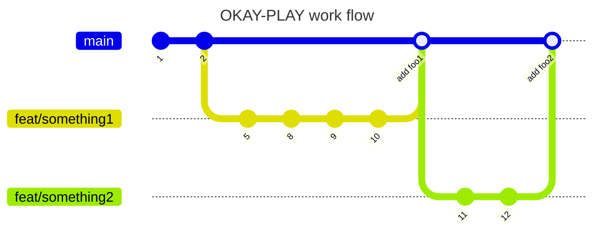

##WORKFLOW

When undertaking a new sprint do the following

1. `git checkout main`
2. `git pull origin main`
3. `git checkout -b <your Branch Name>` for naming branches see recourse below
4. -- DO SOME WORK -- commits for naming branches see recourse below
5. `Git push origin <your Branch Name>`
6. Create pull request
7. Have someone from the team review the code if required
8. Merge PR on github
9. Delete branch on github

Note we may add 'dev' branch later down the line if required

Additional tips:

- `Git pull origin main` **minimum** every morning before you start
- When adding reminder into the code for something that needs to be done later start with `// TODO` as this will allow us to easily figure out needs to be done and add it to Trello board
- Ensure code has been formatted before merging. You can do this automatically with Prettier
- removing unnessory console.logs before committing to 'main'

###Recourse
[Naming Git hub branch](https://stackoverflow.com/a/6065944)
[Working with branches](https://www.atlassian.com/git/tutorials/comparing-workflows/gitflow-workflow)

<!-- TODO add in naming commits -->
